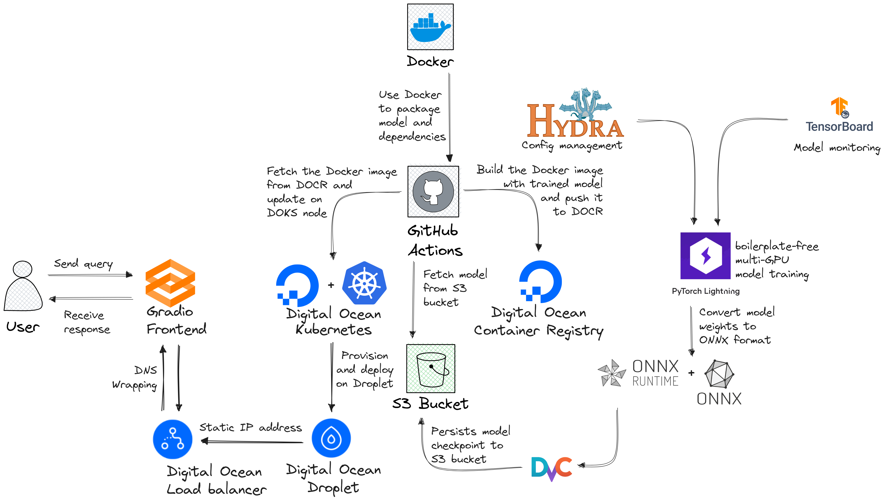

# SeeFood102 (= SeeFood101 + MLOps)

This is an iteration on my previous project [SeeFood101](https://github.com/HangenYuu/SeeFood101). In SeeFood101, I just got familiar with model training, working mostly out of Jupyter Notebook, a folder storing helper function, a Tensorboard session for training monitoring, and simple demo with Gradio [here](https://huggingface.co/spaces/HangenYuu/SeeFood101v1). For model training, this is enough.

However, machine learning does not stop at model training. Usually, a model is trained to solve a business problem, and to serve this end, the model needs *deploying* to be accessible and *monitoring* to make sure that is works properly. This is called MLOps, and it's a totally different breed from model training.

This project is my attempt at learning the ropes of MLOps.

Current progress visualized



## Progress
- ✅ Fine-tune the model on multiple GPUs with PyTorch Lightning
- ✅ Monitor finetuning with Tensorboard and upload the runs online
- ✅ Store the weights in an Amazon S3 bucket
- ✅ Version track the model weights with DVC
- ✅ Convert the PyTorch Lightning checkpoint to ONNX weights and use ONNX Runtime for inference
- ✅ Create the backend with FastAPI and a minimal HTML/Javascript frontend, allowing users to upload image and receive top-5 categories + probabilities
- ✅ Containerize the backend with Docker
- ✅ Store the Docker image in AWS Elastic Container Registry (ECR)
- ✅ Create a GitHub action to automatically construct the Docker image and push to ECR on pushing code to the GitHub repository.
- ❌ Deployment - currently encountering issues.
  - ❌ Intended options: Deploy the Docker image on AWS Elastic Container Service (ECS).
    - Reason: ECS requires a cluster, task, and service. The cluster was created successfully, but the service creation was failed repeatedly.
    - Possible remedy 1: Switch to a Lambda function. This does not allow for environment specification nor fastAPI easyness since I have to use Lambda function format. Because of issues with AWS based Docker image (SQLite 2 (really?) is installed while SQLite 3.8.3 at least is required for DVC) and with installing Lambda interface for external image, I abandoned this once I realized how big a time sink it is.
    - Possible remedy 2: Switch to a different vendor (Digital Ocean, GCP, etc.) (requires more setup and getting started with the platform 😭 and possibly 💸). **I actually tried switching to Digital Ocean**. Now the workflow is SSH into a Droplet, build and run the Docker image within the Droplet every time a push happends. However, it still fails repeatedly ??? This also gives me an idea for the third option.
    - Possible remedy 3: Use an EC2 instance. This is inherently unscalable as using a Digital Ocean Droplet above. However, it is straightforward. Big problem though: is Docker installed within EC2?
- ❌ Add to the GitHub action to automatically deploy the Docker image after construction
- ❌ Setup monitoring with AWS CloudWatch logs, Elastic Search Cluster (to stream the logs), and a dashboard service (Kibana, Grafana, EvidentlyAI, etc.)

For people looking to follow along the repo:

## Setup environment
```sh
conda create -n seefood102 python=3.10
conda activate seefood102
pip install -r requirements.txt
```
## Model training
I chose a pretrained LeVit ([paper](https://arxiv.org/pdf/2104.01136.pdf), [code](https://github.com/facebookresearch/LeViT), [weight](https://huggingface.co/timm/levit_256.fb_dist_in1k)) and then fine-tuned with all parameters unfrozen on the Food101 Dataset. The training code was written with PyTorch Lightning to reduce the amount of boilerplate and utilize the 2 GPUs I was given. I used Tensorboard to monitor the training. The training can be viewed [here](https://tensorboard.dev/experiment/gX8buBf7TJOW8RytJaCA7g/#scalars). At the end, the model achieved ~0.78 F1 and accuracy. After training, you can save your model to `.ckpt` format of PyTorch Lightning to use directly for inference, convert to ONNX format with the `ckpt_to_onnx.py` script before inference with CPU, or save your model directly to ONNX format for inference.

## Setup DVC
I used DVC (Data Version Control), a Git-like tool for data, to track the model weight. The setup depends on your choice of cloud storage. I ~~was forced to choose S3 to increase the prospect of getting a job~~ chose AWS S3 for its popularity and security despite the initial effort needed to set things one bucket (which actually was easy compared to other things AWS offers - more on that later). In any case, from [the documentation](https://dvc.org/doc/user-guide/data-management/remote-storage/amazon-s3#custom-authentication), the steps as of July 2023 are:

1. Go to **IAM Management Console**.
2. Create a new user (recommended) with specified permissions. Besides AWS S3, I want to use this User for the task of ECR and ECS, so I also give the User permissions for these services as needed.
3. Create an S3 bucket with Version Aware set to True.
4. Generate a pair of access key ID - secret and store it locally. This will be needed for DVC to access the object stored in your AWS S3 bucket.
5. Add the access key ID and access key secret to your GitHub Action repository secrets. For local development:
```sh
dvc remote add -d myremote s3://<bucket-create-above>/<further-folder-if-created>
dvc remote modify myremote version_aware true
dvc remote modify --local myremote \
                    access_key_id 'access_key_id_from_above'
dvc remote modify --local myremote \
                    secret_access_key 'secret_access_key_from_above'
dvc remote modify --local myremote \
                    session_token 'required_if_MFA_is_on'
```
And you will be logged in to the S3 bucket.

Now, assume I have finished training and have a model checkpoint `checkpoint.ckpt` stored in `models`. I can add and push the checkpoint to remote storage with Git-like commands
```sh
# Suppose I am at the root folder
dvc add /models/checkpoint.ckpt
# 2 files - `checkpoint.ckpt.dvc` and `.gitignore` will be generated at the `models` folder to tell DVC the location of the object and tell Git to not track the checkpoint
# Now push
dvc push /models/checkpoint.ckpt.dvc
```
If the object is pushed successfully, the model is now stored in the S3 bucket. Navigate there with a browser to check, or use AWS CLI
```sh
aws s3 ls <bucket-create-above>/<further-folder-if-created>/models/
```
You should see something like
```sh
2023-07-25 16:23:03  216279960 checkpoint.ckpt
```
## Backend with FastAPI
[FastAPI](https://fastapi.tiangolo.com/) is blazingly fast to develop and execute, with Pythonic and concise syntax, plus built-in documentation that I can use to test the server. The source code is tored at `app.py`. The backend server is spinned up with [uvicorn](https://www.uvicorn.org/) to support [ASGI](https://github.com/django/asgiref/blob/main/specs/asgi.rst) (basically asynchronous communication between servers). Some knowledge of REST API is needed to use FastAPI.

(Who am I kidding? REST API is needed to use almost any framework)

Annotated code:


After running with `uvicorn`
```sh
uvicorn app:app --host 0.0.0.0 --port 8000
```
Head to `http://localhost:8000/docs` to see the documentation and test the `predict` method out.


## Containerize the application with Docker
You need to install at least Docker Engine first. The method will vary across OS. It is recommended on the website to install the whole thing with Docker Desktop.

Put it simply, Docker is a way to capture the whole software dependencies of an application down to the OS level (that's may be why the product is called "Docker image") and runs it later on a machine with Docker Engine. This is similarly to creating a virtual machine with a different OS (say, Puppy Linux) than the OS of your machine (say, Windows) to run a piece of software, either because it only works on that OS or you want to replicate the original system specifications. Each virtual machine will install a whole OS and run in a different kernel of the host machine. For Docker, every Docker image will run in a shared kernel powered by Docker Engine, resulting in lighter and faster applications. In that sense, Docker Engine can be thought of as some kind of specialized OS used to applications called Docker images. And we may want to do so because this OS offers better performance.

To get started, you need to have a Dockerfile. It is the of how to construct the application. The general steps are
```Dockerfile
# Step 1: Use `FROM` to get a base image (needs Internet access).
# Here I pull down an image of a machine using Ubuntu with conda and Python 3.10 already installed.
# Just as we fine-tune a pretrained model instead of training from scratch,
# I build on top of an existing image instead of reinventing the wheel
FROM continuumio/miniconda3:23.3.1-0

# Step 2: Use `COPY` to copy relevant files to the image
# I have a file called `.dockerignore` to list files I don't want copying just like `.gitignore`
COPY ./ /app

# Step 3 (Optional): Declare the working directory in the image with `WORKDIR`.
# Because I copy the files to `/app`, I switch to `/app`.
# The default is the root folder (`./`)
WORKDIR /app

# Step 4 (Optional): Declare arguments for the build.
# The arguments can be passed into with `--build-arg` flag.
# You can set default value for arguments
# Default is no arguments
ARG AWS_ACCESS_KEY_ID
ARG AWS_SECRET_ACCESS_KEY

# Step 5: List the steps to construct the environment for the codes with `RUN`
# `RUN` will be followed by a bash command

# install requirements
RUN pip install "dvc[s3]" --no-cache-dir
RUN pip install torch==2.0.1 torchvision --index-url https://download.pytorch.org/whl/cpu --no-cache-dir
RUN pip install -r requirements_inference.txt --no-cache-dir

# initialize dvc
RUN dvc init --no-scm

# connect to remote server
RUN dvc remote add -d awsremote s3://food101
RUN dvc remote modify awsremote version_aware true
RUN dvc config core.analytics false
RUN dvc remote modify --local awsremote access_key_id $AWS_ACCESS_KEY_ID
RUN dvc remote modify --local awsremote secret_access_key $AWS_SECRET_ACCESS_KEY

# View config at the build log
RUN cat .dvc/config

# Pull the model ONNX weights
RUN dvc pull models/levit_256/onnx/checkpoints.onnx.dvc

# Step 6: Declare environment variables with `ENV`
ENV LC_ALL=C.UTF-8
ENV LANG=C.UTF-8

# Step 7: Specify ports for data transfer with `EXPOSE`
# By default, a container is closed - no data can be transferred in or out.
EXPOSE 8000

# Step 8: The final command to start the application with `CMD`
# The format used by Docker is EXEC form compared the the SHELL form above
# That's why it is an array of strings
CMD ["uvicorn", "app:app", "--host", "0.0.0.0", "--port", "8000"]
```
The Dockerfile is used to construct the image with example command
```sh
# Assume access key ID and secret are stored as environment variables
docker build --build-arg AWS_ACCESS_KEY_ID=$AWS_ACCESS_KEY_ID \
             --build-arg AWS_SECRET_ACCESS_KEY=$AWS_SECRET_ACCESS_KEY \
             --no-cache --tag $REGISTRY/$IMAGE_NAME:latest .
```
This will construct an image. To create the final container from the image
```sh
docker run -p 8000:8000 --name $IMAGE_NAME $REGISTRY/$IMAGE_NAME:latest
```
`-p` is mapping a port from the container to a port of the host machine in the format host:container. This is necessary because exposing a port is still not making accessible without mapping.

## Testing
The `predict` method expects an image as an attachment. which can be easily constructed with a form. I provide a minimal front-end `index.html`. You can spin it up with Live Server extension or using python
```sh
# Spin up a Python server at port 5500 of localhost
python server python -m http.server 5500
```


After uploading and submitting the image, you should see a dictionary of top-5 categories and probabilities displayed on the screen.


## Obstacles
> Everything was smooth until deployment.

Indeed. Besides the extra learning (I enjoy this) and the countless hours spent on writing `.yaml` file for the Docker image (I do not hate this), it is smooth sailing until deployment... 

## `assets` image sources:
- *Pizza* by Pablo Pacheco via Unsplash: https://unsplash.com/photos/D3Mag4BKqns
- *TensorBoard Logo* from TensorFlow website: https://www.tensorflow.org/tensorboard
- *ONNXRuntime Logo* from Microsoft GitHub repo: https://github.com/microsoft/onnxruntime
- *ONNX Logo* from Linux Foundation AI & Data Foundation Logos and Artwork - ONNX: https://artwork.lfaidata.foundation/projects/onnx/
- *DVC Logo* from DVC website: https://dvc.org/
- *PyTorch Lightning Logo* from Phillip Lippe website: https://phlippe.github.io/post/uvadlc-tutorials-lightning/
- *Hydra Logo* from Facebook Research GitHub repo: https://github.com/facebookresearch/hydra